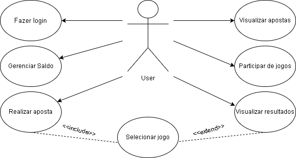

# jogo-de-dados
## levantamento de requisitos

| Código   | Descrição                                                                                     | Prioridade |
| -------- | --------------------------------------------------------------------------------------------- | ---------- |
| **RF01** | O sistema deve permitir o cadastro de novos usuários.                                         | Alta       |
| **RF02** | O sistema deve permitir que o usuário realize login com e-mail e senha.                       | Alta       |
| **RF03** | O sistema deve permitir que o usuário visualize e altere seu saldo.                           | Média      |
| **RF04** | O sistema deve permitir que o usuário selecione um jogo disponível para apostar.              | Alta       |
| **RF05** | O sistema deve permitir que o usuário realize uma aposta, informando valor e opção escolhida. | Alta       |
| **RF06** | O sistema deve registrar as apostas feitas pelo usuário.                                      | Alta       |
| **RF07** | O sistema deve permitir ao usuário visualizar suas apostas anteriores.                        | Média      |
| **RF08** | O sistema deve permitir ao usuário participar de jogos ativos.                                | Alta       |
| **RF09** | O sistema deve permitir ao usuário visualizar o resultado dos jogos após o encerramento.      | Média      |
| **RF10** | O sistema deve atualizar automaticamente o saldo do usuário com base no resultado da aposta.  | Alta       |

## diagrama de classes
)

## diagrama de casos de uso

  

